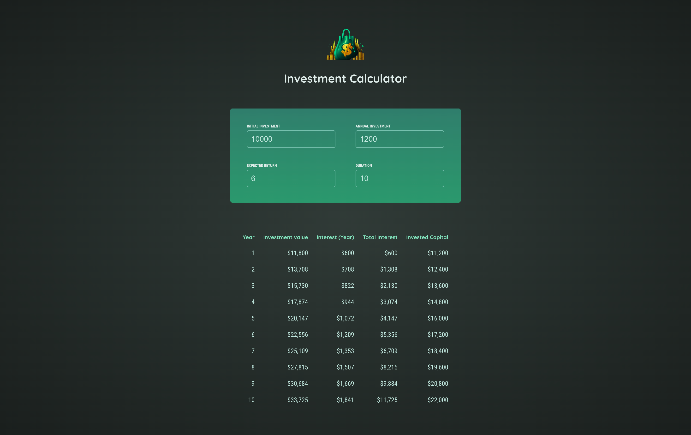

# Investment Calculator

### A simple project built as part of a Udemy course to practice React. 

## Features
- ✅ Calculate investment growth over time
- ✅ Dynamic input handling
- ✅ Real-time results update

## Tech Stack
- React
- Vite

## Usage
- Enter your initial investment, annual contribution, expected return, and investment duration.
- View the projected growth of your investment.
- Adjust values to see how different factors impact the final outcome.

## Installation

1. Clone the repository:
   ```bash
   git clone https://github.com/halynabondar/InvestmentCalculator.git
   ```
   
2. Install dependencies:
   ```bash
   npm install
   ```
   
3.	Start the project:
   ```bash
   npm run dev
   ```

## Screenshots

